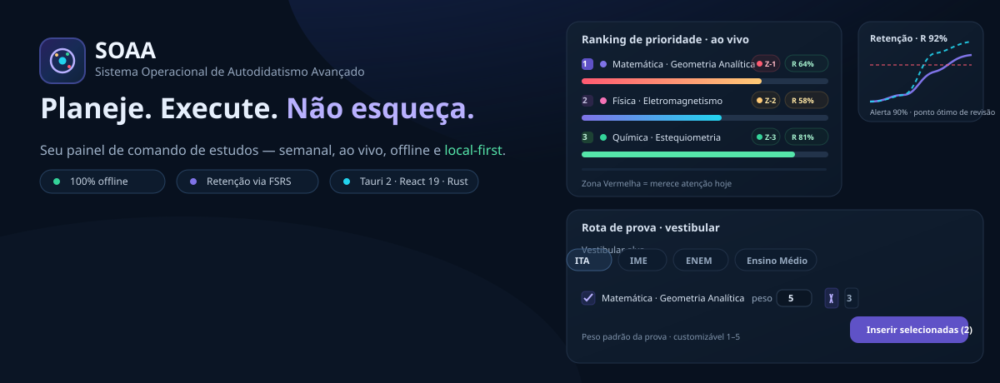
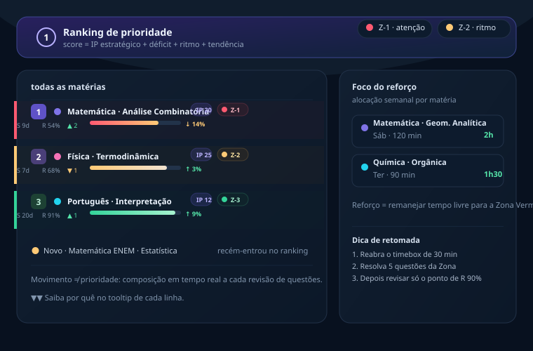
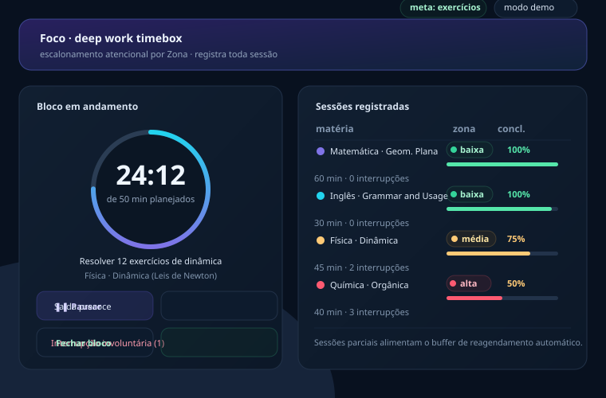
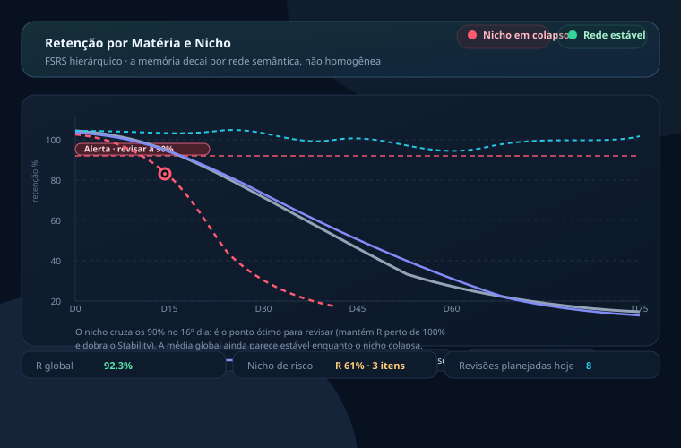
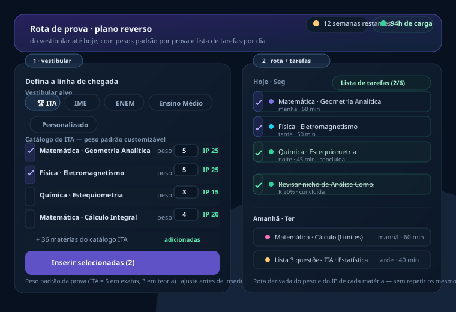
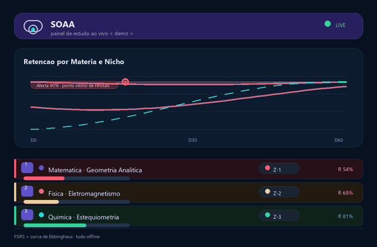
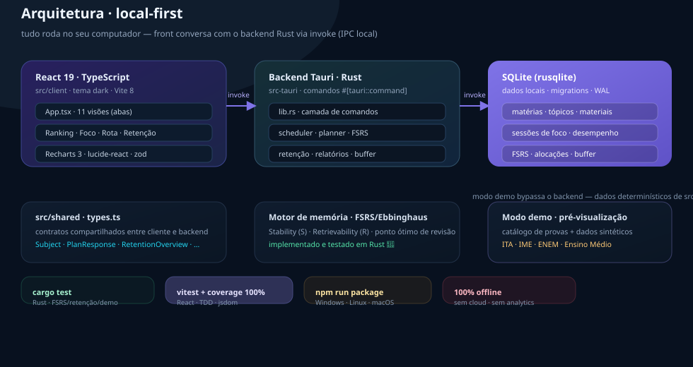

<div align="center">



# SOAA — Sistema Operacional de Autodidatismo Avançado

**Aplicativo desktop, offline e local-first para planejar, executar e reter o autodidatismo.**


</div>

---

## Tabela de conteúdos

- [Sobre](#-sobre)
- [Funcionalidades](#-funcionalidades)
- [Interface do aplicativo](#%EF%B8%8F-interface-do-aplicativo)
- [Como rodar](#-como-rodar)
- [Como funciona](#-como-funciona)
  - [Retenção e memória (SRS/FSRS)](#-retenção-e-memória-srsfsrs)
  - [Rota de prova por vestibular](#-rota-de-prova-por-vestibular)
  - [Modo demonstração](#-modo-demonstração)
- [Testes e qualidade](#-testes-e-qualidade)
- [Stack](#-stack)
- [Estrutura de pastas](#-estrutura-de-pastas)
- [FAQ](#-faq)
- [Privacidade](#-privacidade)
- [Roadmap](#-roadmap)
- [Contribuindo](#-contribuindo)

---

## 🌱 Sobre

O SOAA é um painel de comando de estudos que transforma metas vagas
("passei no ITA") em um plano semanal com **peso por matéria**, ranqueia o que
precisa de atenção **hoje** e monitora o **decaimento da memória** para revisar
exatamente no ponto certo — aplicando os algoritmos do estudo espaçado (FSRS)
a todo o planejamento.

> **Para quem:** maratonistas de vestibular (ENEM/ITA/IME), autodidatas e
> estudantes com vários materiais para conciliar em uma rotina.

> 💡 **Visão de produto:** a memória não decai homogênea — ela decai por *rede
> semântica*. O SOAA mostra a retenção no nível *matéria › nicho* para você
> intervir antes do colapso, não depois.

---

## ⚡ Funcionalidades

| Módulo | O que faz |
|---|---|
| **Visão geral** | métricas do dia, retenção, urgências e próximo bloco de foco |
| **Matriz / Ranking** | ordem de ataque calculada ao vivo em **Zonas 1/2/3** |
| **Rota de prova** | plano reverso do vestibular com pesos padrão por prova |
| **Foco (deep work)** | timebox atencional, interrupções e histórico de sessões |
| **Questões e gráficos** | desempenho por matéria/tópico e tendência de acerto |
| **Memória (FSRS)** | curva de decaimento, revisões fáceis/boas/difíceis e drill-down por nicho |
| **Retenção por matéria/nicho** | Ebbinghaus hierárquico + linha de alerta dos 90% |
| **Reagendamento (buffer)** | saldo devedor realocado sem efeito dominó |
| **Biblioteca** | materiais, estratégias e avanço de leitura |

**Zonas de prioridade** — o score de cada matéria combina **peso estratégico (IP)**,
**déficit contra a meta**, **ritmo recente** e **tendência de 7 dias**:

| Zona | Leitura |
|---|---|
| 🔴 Zona 1 | merece atenção **hoje** |
| 🟡 Zona 2 | mantenha o ritmo |
| 🟢 Zona 3 | siga o plano normal |



**Foco (deep work)** — bloco com meta, pausa/retoma, interrupções e saída
precoce justificada; sessões parciais viram saldo devedor automatizado:



---

## 🖥️ Interface do aplicativo

Janela desktop com **barra de título própria** e **barra lateral esquerda** de
navegação. Em modo demo, um selo *Pré-visualização* indica dados sintéticos.

```
┌──────────────────────────────────────────────────────────────┐
│ SOAA · Sistema Operacional de Autodidatismo Avançado   — □ × │
├──────────────────────────┬───────────────────────────────────┤
│ ◉ Visão geral            │     (conteúdo da visão ativa)     │
│ ▦ Matriz de priorização  │                                   │
│ ▤ Planejamento semanal   │                                   │
│ ▶ Foco — Deep Work       │                                   │
│ ▱ Desempenho             │                                   │
│ ⤴ Avanço por matéria     │                                   │
│ ▤ Ranking de prioridade  │                                   │
│ ▧ Biblioteca             │                                   │
│──────────────────────────│                                   │
│ ● Pré-visualização · demo│                                   │
└──────────────────────────┴───────────────────────────────────┘
```

**Visão geral** — hero panel com as métricas do dia: carga planejada, retenção
atual, urgências do ranking e o próximo bloco de foco.

**Matriz de priorização** — a tabela-mãe: cada matéria exibe **IP** (peso ×
dificuldade), **% de acerto recente**, **zona** e barra de progresso do reforço.
O botão *Alocar reforço ou gerenciar* agenda 90–120 min em um dia da semana.

**Planejamento semanal** — a semana em colunas com os slots por matéria e o
total de horas; dias de descanso aparecem esmaecidos e o teto vem do perfil.

**Foco — Deep Work** — o fluxo operacional:
1. *Novo bloco de foco* escolhe matéria, **meta** (páginas/exercícios/tópicos)
   e tempo planejado (baseado no histórico de sustentação);
2. durante o bloco: **pausa/retoma**, **interrupções involuntárias** e **saída
   precoce** com motivo (fadiga metabólica, distração externa, dificuldade…);
3. ao fechar, a sessão vai para o histórico com *zona* e *% de conclusão* — e as
   parciais alimentam o **buffer de reagendamento**.

**Desempenho** — tendência de acerto (dia/semana/mês/ano + filtro por matéria e
tópico), **radar de proficiência**, conformidade de timeboxing, evolução de
acerto, sobrecarga progressiva de foco, **decaimento da memória** (Anki/FSRS),
revisões de itens de memória e o card *livestream de retenção*.

**Avanço por matéria** — metas, chip de status do tópico
(`concluído`/`em andamento`/`pendente` — clique para ciclar), avanço de páginas
e *Salvar metas*.

**Ranking de prioridade** — a leitura executiva: posições com movimento
(⬆/⬇/novo), zonas coloridas e alocação de reforço, com dicas de retomada.

**Biblioteca** — materiais com categoria, status, páginas e a estratégia
recomendada (banco cronológico, ficha de síntese, Feynman, resolução ativa,
flashcards).

> **Loop de uso sugerido:** `Planejar → Priorizar → Focar → Medir → Revisar`.
> O ranking diz *o que* atacar hoje; o buffer devolve o saldo devedor para os
> slots protegidos da semana.

---

## 🚀 Como rodar

**Pré-requisitos:** Node.js 20+, Rust (stable) e as dependências de sistema do
Tauri ([prerequisites](https://tauri.app/start/prerequisites/)).

```bash
# 1) instalar dependências
npm install

# 2) desenvolvimento — janela desktop + hot reload
npm run dev

# 3) só o frontend no navegador
npm run dev:web
```

### Scripts disponíveis

| Script | Descrição |
|---|---|
| `npm run dev` | `tauri dev` — janela do app + dev server |
| `npm run dev:web` | só o frontend no navegador |
| `npm run build` | build de produção do frontend |
| `npm run preview` | preview do build |
| `npm test` | testes Rust: `cargo test` |
| `npm run test:web` | testes React: `vitest run` |
| `npx tsc --noEmit` | typecheck TypeScript (strict) |
| `npx vitest run --coverage` | testes + relatório de cobertura |
| `npm run package` | build instalável (Tauri) |
| `npm run package:win` | instalador NSIS (Windows) |
| `npm run package:linux` | AppImage + deb |
| `npm run package:mac` | `.app` (macOS) |

---

## 🔬 Como funciona

### 🧠 Retenção e memória (SRS/FSRS)

Cada item de memória tem **Stability (S)** — dias em que a retenção permanece
alta — e **Retrievability (R)** — probabilidade de lembrar hoje, dada pela curva
exponencial de Ebbinghaus:

```
R = 1 / (1 + Δt / (9 × S))
```

O motor é implementado em **Rust** (testado por `cargo test`) e plotado com
**Recharts**. Revisar no ponto em que **R cruza os 90%** reestabelece a retenção
a ~100% e aumenta o Stability — o ponto ótimo destacado em vermelho no gráfico.



### 🎯 Rota de prova por vestibular

Escolha a prova alvo e o catálogo já vem com os **pesos padrão do exame**
(customizáveis um a um antes de inserir na matriz):

- **Ensino Médio** e **ENEM** — Ciências, Humanas e Linguagens;
- **ITA** e **IME** — matemática, física e química em nível militar;
- **Personalizado** — catálogo completo.

A rota também gera a **lista de tarefas por dia** (matéria, turno e duração),
sem repetir os mesmos focos entre dias consecutivos.

> ⏱️ **Não escolha por gosto:** o peso padrão da prova já reflete a distribuição
> de questões do vestibular. Ajuste quando seu déficit pedir.



### 🧪 Modo demonstração

Sem cadastrar nada, o app abre com dados sintéticos e determinísticos
(`src/client/demo.ts`), marcados com o selo *Pré-visualização*: ranking,
gráficos, rota de prova e o livestream de retenção — tudo gerado localmente,
sem nenhuma chamada ao backend.



---

## ✅ Testes e qualidade

- **Backend (Rust):** FSRS, retenção, scheduler e demo — `npm test`.
- **Frontend (React):** **74 testes** com Vitest + Testing Library cobrindo o
  fluxo completo de cada tela (matriz, rota, foco, retenção, triage…).
- **Cobertura:** o `vitest.config.ts` exige **100%** em *statements*, *lines*,
  *functions* e *branches* — o pipeline falha antes do merge com linha nova
  sem teste.
- **Tipagem:** TypeScript em modo *strict*.

> 🔒 *Quality gate:* `tsc --noEmit` limpo + `vitest --coverage` (thresholds 100%) + `cargo test` verde.

---

## 🏗 Stack

| Camada | Tecnologia |
|---|---|
| Shell desktop | [Tauri 2](https://tauri.app) (Rust) |
| UI | React 19 + TypeScript (strict) |
| Build front | Vite 8 · [Recharts 3](https://recharts.org) · [lucide-react](https://lucide.dev) |
| Banco de dados | SQLite via `rusqlite` (bundled) — migrations + WAL |
| Validação | Zod 4 |
| Testes front | Vitest + Testing Library (jsdom) · cobertura v8 |
| Testes back | `cargo test` (Rust) |

O fluxo é sempre local: o front **React** conversa com o backend **Tauri/Rust**
via `invoke` (IPC local) e os dados persistem num **SQLite** no seu disco.



---

## 📁 Estrutura de pastas

<details>
<summary><b>Expandir árvore</b></summary>

```
estudos/
├── src/
│   ├── client/            # UI React: App, ranking, focus, wizard, cognitive,
│   │   │                  #   retention, advancement, triage, api, demo, styles.css
│   │   ├── catalog.ts     # catálogo de provas (pesos padrão + trilhas)
│   │   └── test/          # setup do Vitest
│   └── shared/            # contratos compartilhados (types.ts)
├── src-tauri/
│   ├── src/
│   │   ├── lib.rs         # comandos Tauri #[tauri::command]
│   │   ├── database.rs    # rusqlite · migrations · consultas
│   │   ├── models.rs      # modelos de domínio
│   │   └── scheduler.rs   # reforço / alocação / buffer
│   ├── Cargo.toml
│   └── tauri.conf.json
├── assets/                # imagens e demo GIF do README
├── scripts/               # geradores de assets
├── vitest.config.ts       # Vitest + thresholds de cobertura 100%
├── package.json
└── vite.config.ts
```

</details>

---

## ❔ FAQ

**O app precisa de internet?**
Não. É 100% offline — sem servidor, sem nuvem, sem analytics.

**Posso experimentar sem criar nada?**
Sim. O modo *Pré-visualização* (demo) popula ranking, gráficos e rota com dados
sintéticos determinísticos.

**Onde ficam meus dados?**
Em um SQLite local dentro do perfil do app. Migrações e WAL inclusos.

**Dá para rodar só o frontend no navegador?**
Sim: `npm run dev:web` abre o Vite no browser — o modo demo funciona sem o
backend, mas as gravações reais usam o `invoke` do Tauri.

---

## 🔒 Privacidade

**100% offline e local-first.** Sem chamadas de rede, sem cloud, sem telemetria.
O Tauri só expõe comandos locais (`invoke`) ao frontend; seus registros de
estudo ficam protegidos no seu próprio disco.

> 🔐 *Nenhum dado sai da sua máquina — nem para telemetria.*

---

## 🗺 Roadmap

- [ ] Integrar as zonas de retenção do histórico de foco às zonas do ranking
- [ ] Filtros por período nos gráficos de decaimento
- [ ] Exportação de relatórios (CSV/Markdown)
- [ ] Rankeamento por prova (ENEM/ITA/IME) com pesos por edição

---

## 👋 Contribuindo

Projeto pessoal, mas melhorias são bem-vindas:

1. Faça um *fork* e crie um branch (`git checkout -b feat/improvement`);
2. Garanta o *quality gate* antes do PR:

```bash
npx tsc --noEmit
npm run test:web
npx vitest run --coverage
cargo test --manifest-path src-tauri/Cargo.toml
```

3. Abra um *pull request* descrevendo o que mudou e por quê.

---

<div align="center">

**SOAA** · estudar não é uma guerra de conteúdo — é um sistema operacional.

</div>